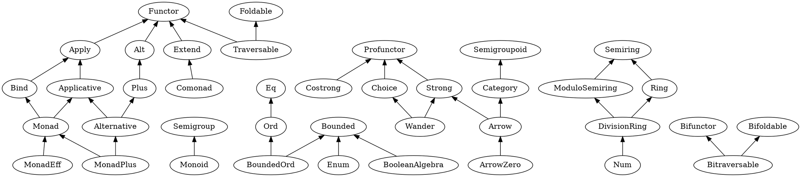

```dot
digraph G {
    rankdir="BT";
    aize ="4,4";

    Apply -> Functor;
    Applicative -> Apply;
    Bind -> Apply;
    Monad -> Applicative;
    Monad -> Bind;
    Traversable -> Functor;
    Traversable -> Foldable;
    MonadPlus -> Monad;
    MonadPlus -> Alternative;
    Alternative -> Plus;
    Alternative -> Applicative;
    Plus -> Alt;
    Alt -> Functor;
    Extend -> Functor;
    Comonad -> Extend;
    MonadEff -> Monad;


    Monoid -> Semigroup;


    Ord -> Eq;
    Enum -> Bounded;
    BoundedOrd -> Ord;
    BoundedOrd -> Bounded;
    BooleanAlgebra -> Bounded;


    Category -> Semigroupoid;
    Costrong -> Profunctor;
    Choice -> Profunctor;
    Strong -> Profunctor;
    Wander -> Strong;
    Wander -> Choice;
    Arrow -> Category;
    Arrow -> Strong;
    ArrowZero -> Arrow;

    ModuloSemiring -> Semiring;
    Ring -> Semiring;
    DivisionRing -> Ring;
    DivisionRing -> ModuloSemiring;
    Num -> DivisionRing;

    Bitraversable -> Bifunctor;
    Bitraversable -> Bifoldable;
}

```

* http://www.webgraphviz.com/
